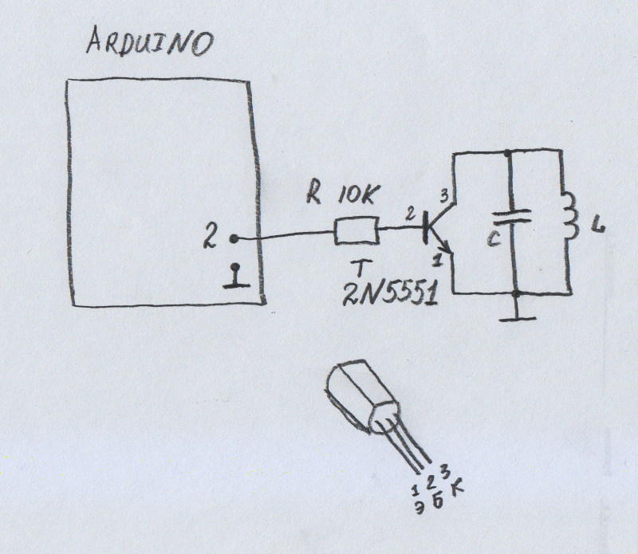

# RFID emulator EM4102

This is the simplest 125 kHz RFID tag emulator on Arduino.

Antenna and resonant capacitor taken from RDM6300 shield.

Everything is connected according to the following scheme:

ID-card is defined in the definition: CARD_ID 0x0001020304
