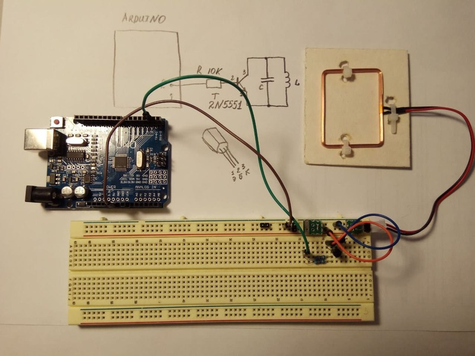
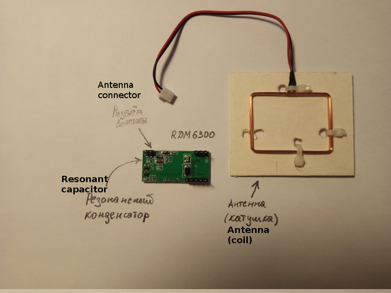
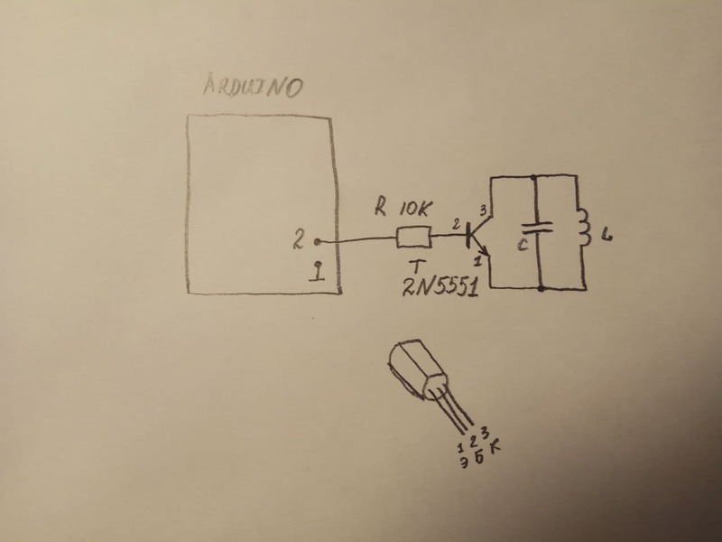

# Эмулятор RFID EM4102

Это простейшй эмулятор RFID меток 125 кГц на Arduino. 

Антенна и резонансный конденсатор взят от шилда RDM6300

Всё подключается по следующей схеме:

ID-карты задаётся в дефайне: CARD_ID 0x0001020304
